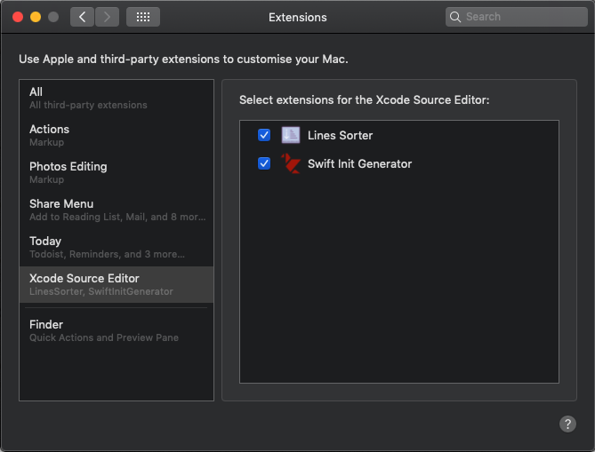
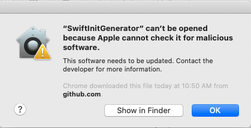
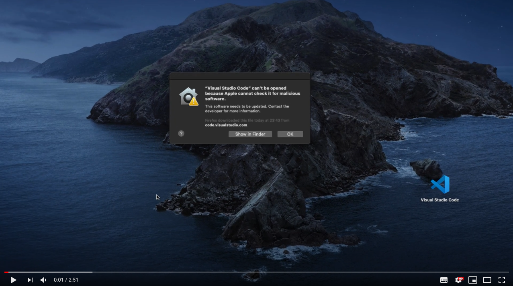
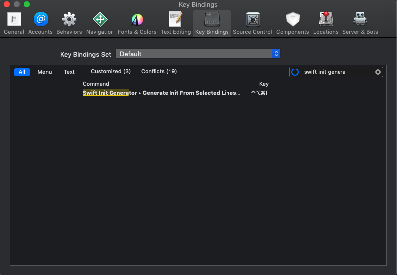

    

# Swift Init Generator

 

**Swift Init Generator** is an Xcode Source Editor extension that makes it easy to generate your init, especially for public types.

## Features

- [X] ⚒ No longer hack your Xcode to install custom plugins.  
- [X] 📃 Generate Init from any selected variables, filter static, computed and etc.

## Examples

### Generation From The Selected Lines

## Installation

**Option 1:**
- Download latest *SwiftInitGenerator* package from the [Releases](https://github.com/Atimca/SwiftInitGenerator/releases).
- Copy *SwiftInitGenerator* to your *Applications* folder.
- Launch *SwiftInitGenerator* once. You can close it immediately afterwards.
- Go to <kbd>System Preferences</kbd> > <kbd>Extensions</kbd> > <kbd>Xcode Source Editor</kbd> > select <kbd>Swift Init Generator</kbd>  
    

If you have this alert:

> “SwiftInitGenerator” can’t be opened because Apple cannot check it for malicious software.

Please watch this video for instruction steps:

**Option 2:**
- Just download source code and build it on your machine😉

## Setting Hotkey in Xcode

- Open Xcode
- Go to Xcode > Preferences > Key Bindings
- Type *'Swift Init Generator'* in search field
- Assign <kbd>⌃</kbd> + <kbd>⌘</kbd> + <kbd>⎇</kbd> + <kbd>I</kbd> to *Generate Init From Selected Lines*

## Feedback

Pull requests, issues and suggestions are warmly welcome.
